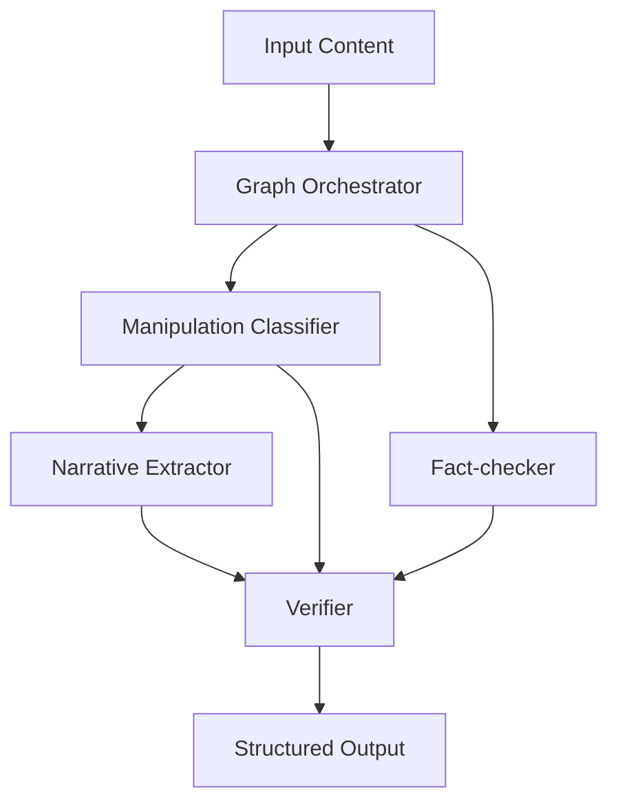

# Architecture Requirements Document (ARD)

## 1. System Overview

VerifAI is a multi-agent system designed to detect, analyze, and correct misinformation narratives in digital content. The system employs a computational graph architecture using the LangGraph framework to orchestrate five core components that work together to provide comprehensive content analysis.

## 2. Architecture Design

### 2.1 High-Level Architecture



### 2.2 Component Architecture

The system follows a microservice-style agent architecture where each node performs a specific function:

- **State Management**: Centralized state using LangGraph's StateGraph
- **Parallel Processing**: Manipulation Classifier and Fact-checker run in parallel
- **Sequential Dependencies**: Narrative Extractor depends on Manipulation Classifier output
- **Final Aggregation**: Verifier synthesizes all outputs

## 3. Technical Stack

### 3.1 Core Technologies
- **Framework**: LangGraph for computational graph orchestration
- **ML Models**:
  - HuggingFace Transformers for manipulation detection
  - Google Gemini API for natural language processing
- **Search**: Google Search API for fact verification
- **Language**: Python 3.12+

### 3.2 Dependencies
```python
dependencies = [
    "langgraph>=0.6.7",        # Graph orchestration
    "transformers>=4.56.1",     # ML model inference
    "torch>=2.8.0",            # PyTorch backend
    "google-genai>=0.1.0",     # Modern Gemini API
    "googlesearch-python>=1.2.5"  # Web search
]
```

## 4. Component Specifications

### 4.1 State Schema

```python
class VerifaiState(TypedDict):
    # Input
    content: str

    # Manipulation Classifier outputs
    manipulation_probability: Optional[float]
    manipulation_techniques: Optional[List[str]]

    # Narrative Extractor outputs
    narrative: Optional[str]

    # Fact-checker outputs
    search_queries: Optional[List[str]]
    search_results: Optional[List[str]]
    fact_check_results: Optional[str]

    # Final output
    final_result: Optional[dict]
```

### 4.2 Node Specifications

#### 4.2.1 Manipulation Classifier
- **Model**: `olehmell/ukr-manipulation-detector-modern-liberta`
- **Threshold**: 0.15 (configurable)
- **Input**: Raw content text
- **Output**: Probability score and detected techniques
- **Performance**: GPU-optimized with pipeline caching

#### 4.2.2 Narrative Extractor
- **Model**: Gemini 2.5 Flash (Pro fallback)
- **Dependencies**: Manipulation Classifier output
- **Function**: Extract main narrative based on manipulation context
- **Prompt Engineering**: Technique-aware narrative extraction

#### 4.2.3 Fact-checker
- **Model**: Gemini 2.5 Flash
- **Tools**: Google Search API
- **Process**:
  1. Generate targeted search queries
  2. Perform web searches (max 3 queries, 3 results each)
  3. Analyze factual accuracy
- **Rate Limiting**: 1-second delays between searches

#### 4.2.4 Verifier
- **Model**: Gemini 2.5 Flash (Pro fallback)
- **Dependencies**: All previous node outputs
- **Output Format**:
```json
{
    "manipulation": boolean,
    "techniques": [array],
    "disinfo": [array],
    "explanation": string
}
```

## 5. Data Flow Architecture

### 5.1 Execution Graph

```python
graph.add_edge(START, "manipulation_classifier")
graph.add_edge(START, "fact_checker")
graph.add_edge("manipulation_classifier", "narrative_extractor")
graph.add_edge("narrative_extractor", "verifier")
graph.add_edge("manipulation_classifier", "verifier")
graph.add_edge("fact_checker", "verifier")
graph.add_edge("verifier", END)
```

### 5.2 Parallel Execution
- **Phase 1**: Manipulation Classifier and Fact-checker execute in parallel
- **Phase 2**: Narrative Extractor processes manipulation results
- **Phase 3**: Verifier aggregates all outputs for final decision

## 6. Configuration Management

### 6.1 Environment Variables
```bash
GEMINI_API_KEY=required    # Google Gemini API access
```

### 6.2 Model Configuration
- **Manipulation Threshold**: 0.15 (adjustable in code)
- **Search Limits**: 3 queries × 3 results
- **GPU Support**: Automatic CUDA detection

## 7. Error Handling & Resilience

### 7.1 Fallback Strategies
- **API Failures**: Graceful degradation with error messages
- **Model Loading**: Pipeline caching and retry mechanisms
- **JSON Parsing**: Manual structure creation on parse failures

### 7.2 Validation
- **Input Validation**: Content sanitization and length checks
- **Output Validation**: Required field verification
- **State Consistency**: Type checking throughout pipeline

## 8. Performance Considerations

### 8.1 Optimization Strategies
- **Model Caching**: Global pipeline initialization
- **Parallel Execution**: Independent nodes run concurrently
- **Rate Limiting**: Search API compliance
- **Memory Management**: Efficient state passing

### 8.2 Scalability
- **Stateless Design**: Each invocation is independent
- **Resource Isolation**: Node-level error containment
- **API Efficiency**: Batch processing where possible

## 9. Security Considerations

### 9.1 API Security
- **Environment Variables**: Secure credential storage
- **Rate Limiting**: Respect API quotas and limits
- **Error Messages**: No credential leakage in logs

### 9.2 Content Security
- **Input Sanitization**: Safe text processing
- **Output Validation**: Structured response verification
- **Search Safety**: Query filtering and result validation

## 10. Future Architecture Considerations

### 10.1 Extensibility Points
- **Plugin Architecture**: Additional node types
- **Model Swapping**: Configurable model endpoints
- **Output Formats**: Multiple response formats
- **Evaluation Framework**: Performance metrics integration

### 10.2 Monitoring & Observability
- **Logging**: Structured logging for each node
- **Metrics**: Performance and accuracy tracking
- **Tracing**: Request flow visualization
- **Health Checks**: System status endpoints

## 11. Deployment Architecture

### 11.1 Local Development
```bash
# Setup
cp .env.example .env
uv sync
python main.py
```

### 11.2 Production Considerations
- **Container Support**: Docker deployment ready
- **API Gateway**: REST API wrapper potential
- **Load Balancing**: Horizontal scaling capability
- **Caching**: Response caching for repeated content